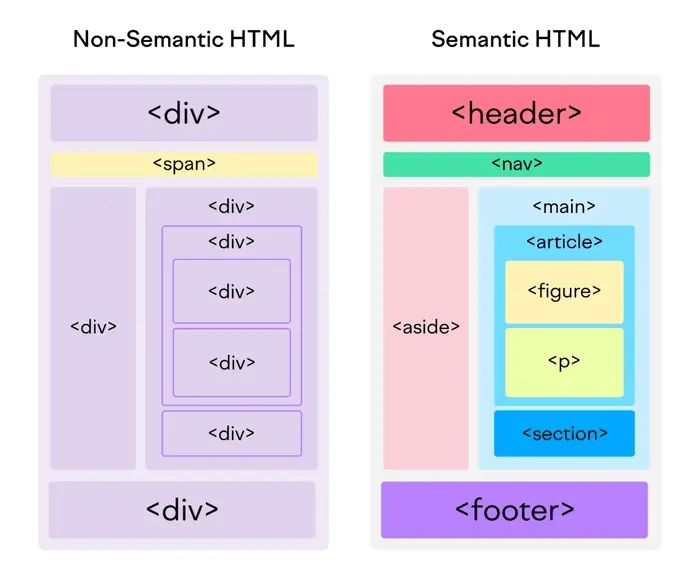

# Semântica em HTML

## Histórico
- Antimante estruturava-se as páginas com 
 e  e até mesmo com <table> para organizar o layout.
- Agora, com HTML5, temos elementos semânticos que descrevem melhor o conteúdo da página.

## Elementos semânticos
- `<header>`: Cabeçalho da página ou seção.
- `<nav>`: Navegação da página.
- `<main>`: Conteúdo principal da página. Devem ser usados apenas uma vez por página e não devem ser usados dentro de outras tags semânticas.
- `<article>`: Conteúdo independente, como um post de blog.
- `<section>`: Seção de conteúdo relacionado.
- `<aside>`: Conteúdo relacionado, mas não essencial, como uma barra lateral.
- `<footer>`: Rodapé da página ou seção.
- `<figure>`: Elemento gráfico, como uma imagem ou diagrama.
- `<figcaption>`: Legenda para o elemento `<figure>`.
- `<address>`: Informações de contato do autor ou proprietário do documento.
- Etc.

## Benefícios do HTML semântico
